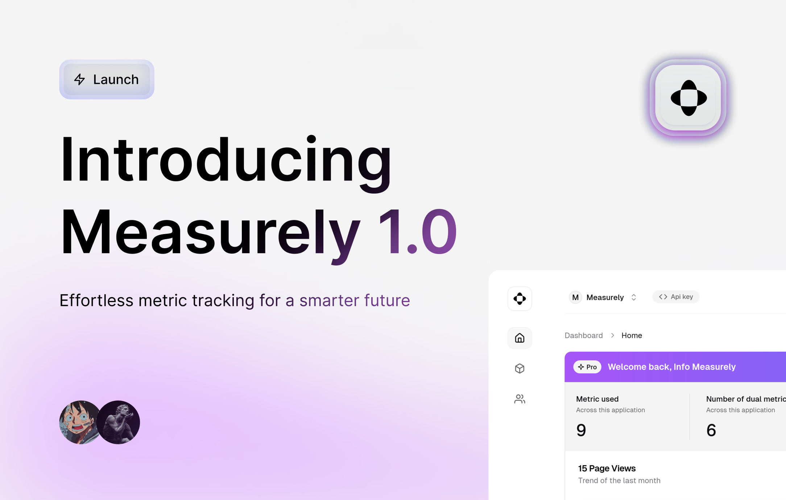

# Why Measurely?

When we started developing apps that required custom metric tracking, we quickly realized that existing solutions were fragmented and complex. We were stuck using multiple disconnected tools, none of which provided the flexibility we needed. This led us to rethink the entire approach.

Measurely was born from the need for a streamlined, developer-friendly analytics platform. We built it to be simple, flexible, and scalable, empowering developers and businesses to track their metrics with ease.

Our mission is simple: simplify metric tracking for developers, so you can focus on what matters most—growing your business.

## The Problem We're Solving

The analytics landscape is cluttered with tools that cater to enterprise clients or are overly complicated for small teams and individual developers. There's a lack of tools that balance simplicity with flexibility, especially for modern web and app development needs.

**Measurely solves this by providing:**

- **Simple API:** Get started with minimal setup and start tracking metrics instantly.
- **Customizable Metrics:** Track any type of metric you need, from basic values to more complex ones like averages or dual metrics.
- **Real-Time Dashboards:** View your data as it comes in, without delays. Make decisions based on up-to-date insights.

We believe metric tracking should be easy, flexible, and actionable, not a cumbersome process.

## Why Measurely, Why Now?

Many analytics tools have been around for years, but they haven’t evolved to meet the needs of developers. With Measurely, we’re taking a fresh approach. We’re building a platform that’s intuitive for developers and powerful enough for modern applications.

As businesses become more data-driven, the need for real-time, customizable analytics is stronger than ever. Existing tools are too rigid, too complex, or simply outdated. Measurely is built to fill this gap, providing a platform that's ready for the future of analytics.

## The Measurely Advantage

Measurely isn't just another analytics tool—it's a platform built by developers, for developers. It’s designed to integrate seamlessly into your projects, making it easier to connect and visualize data.

With upcoming integrations like **AWS CloudWatch**, **Google Analytics**, and more, Measurely is evolving to offer an all-in-one solution for your analytics needs.

---

## Join the Movement

We’re excited to bring Measurely to developers and businesses who need a better way to track their metrics. Whether you’re building an app, managing a business, or just looking for a simpler way to understand your data, Measurely is the solution you’ve been waiting for.

Get started today and be part of the open-source community driving the future of real-time analytics.

[Explore Measurely](https://measurely.dev)

---

Also, check us out on Product Hunt: [Measurely on Product Hunt](https://www.producthunt.com/posts/measurely?embed=true&utm_source=badge-featured&utm_medium=badge&utm_souce=badge-measurely).
