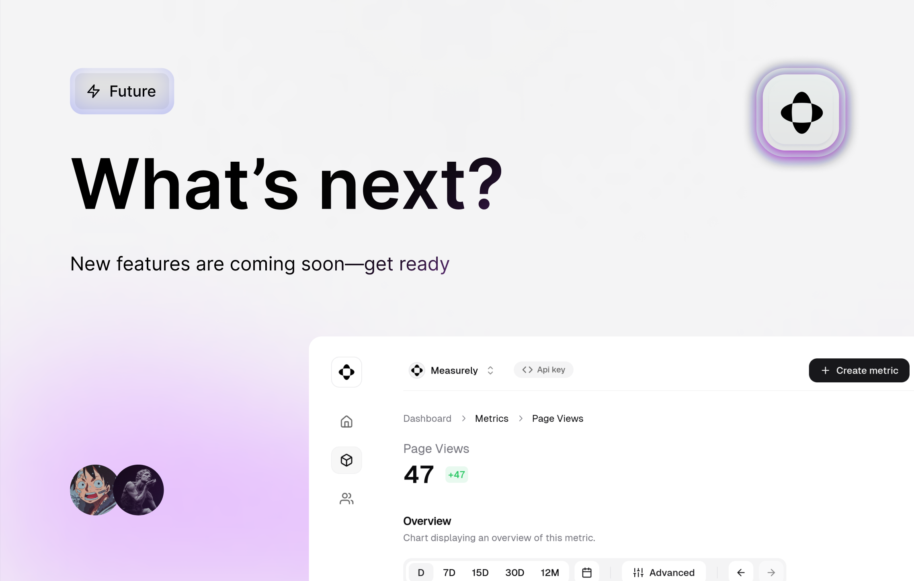

## What's Next for Measurely?

We’ve got some exciting updates coming soon to Measurely that will elevate your experience. From deeper integrations to more flexibility in managing your metrics and teams, here’s what you can look forward to:

---

### Advanced Integrations

Measurely is expanding its integration capabilities. Soon, you’ll be able to connect your Measurely account with powerful tools like **AWS CloudWatch**, **Google Analytics**, and more. This opens up new possibilities for tracking and visualizing data across different platforms, making it easier to bring everything into one cohesive dashboard.

**Why this matters**:
Integrating with tools you already use means you won’t have to switch between platforms. Get all your data in one place, ready to be analyzed, without any manual setup.

---

### Multi-Metric Tracking

A feature that will take your analytics to the next level—multi-metric tracking. This allows you to combine multiple metrics into a single chart. You can track interactions between metrics, giving you a fuller picture of how different factors are impacting your app or business. Whether it's user engagement, revenue, or any other interaction, you'll be able to correlate multiple variables seamlessly.

**Exact definition**:
_"Multi-metric tracking combines multiple metrics into one view, giving a complete overview of complex interactions and trends."_

This feature is ideal for analyzing intricate relationships between metrics that tell a more detailed story about your app's performance.

---

### Enhanced Team Management

Soon, managing teams within Measurely will be even easier. With role-based access, you’ll be able to manage your project’s team members—assigning permissions to Owners, Admins, Developers, and Guests. Whether you're working on a solo project or collaborating with a team, this feature will keep things organized and efficient, giving everyone the right level of access.

---

### Customizable Data Visualizations

We’re introducing greater flexibility with **customizable block pages**. Now you can create and organize multiple charts (blocks) in a way that suits your specific needs. Whether you want to visualize metrics, compare data, or build complex dashboards, you’ll have the tools to present your data exactly how you want it.

With **blocks**, you can track any metric, apply filters, and display your data through a variety of charts, giving you the freedom to showcase your data and insights in the most effective way possible.

---

### What's Coming Next?

Measurely is evolving rapidly, and we're committed to delivering the features that matter most to developers. In the coming months, expect even more integrations with popular tools like **LemonSqueeze**, new metric types, and enhanced customization options. We're focused on making Measurely the most flexible and powerful platform for real-time analytics.

---

**Ready for the future of analytics?**
Stay tuned for updates, and be one of the first to experience these powerful features. [Join us at Measurely](https://measurely.dev) and see how we’re shaping the future of analytics.
