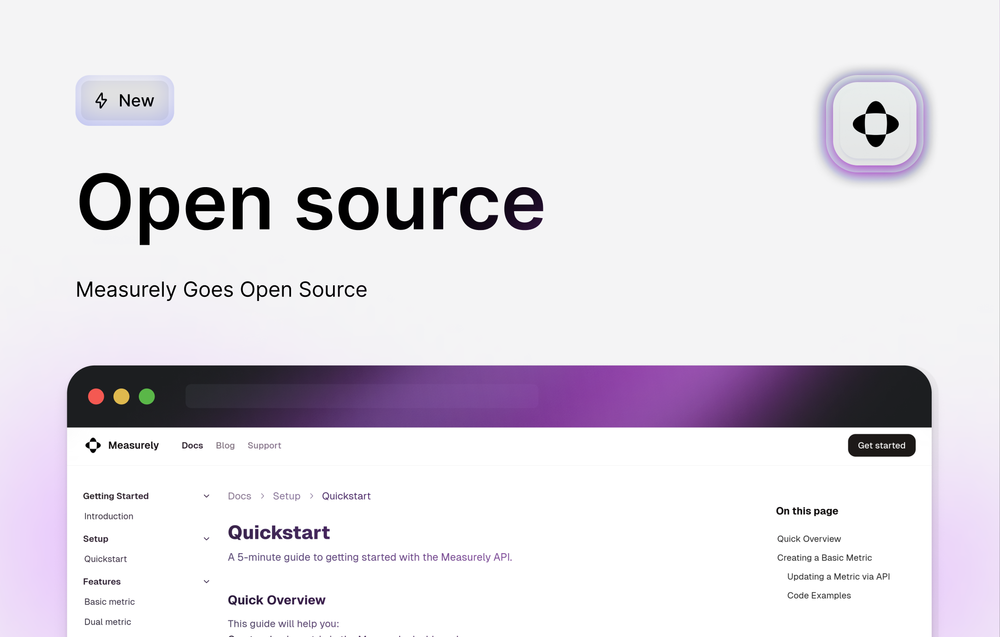
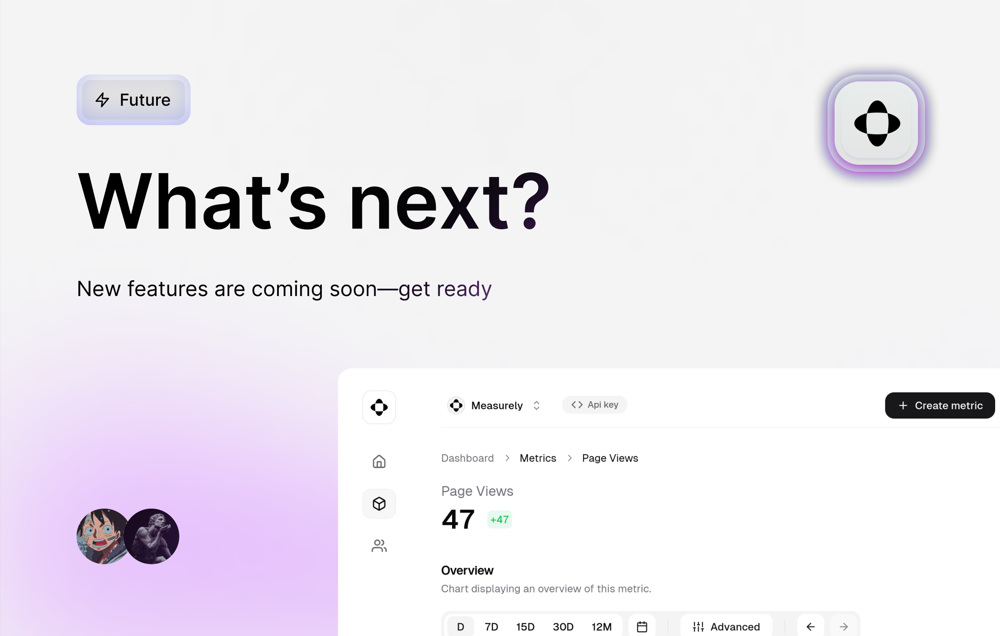

import { Cards, Image } from "nextra/components";
import { cloneElement } from "react";

# Explore blogs

Explore the latest updates and news about Measurely.

<br/ >

{/* prettier-ignore */}
<Cards>
  <></>
  <></>
  <></>
  <></>
</Cards>

export default function MdxLayout(props) {
  return cloneElement(props.children, {
    components: {
      img: (props) => (
        <Image {...props} className="[aspect-ratio:12/6.3] object-cover" />
      ),
      a({ children, href }) {
        const { alt } = children.props;
        return (
          <Cards.Card
            href={href}
            title={alt.replace(/ preview$/i, "")}
            target="_blank"
            rel="noreferrer"
            arrow
            className="!no-underline"
          >
            {children}
          </Cards.Card>
        );
      },
      p(props) {
        return (
          

        );
      },
    },
  });
}
