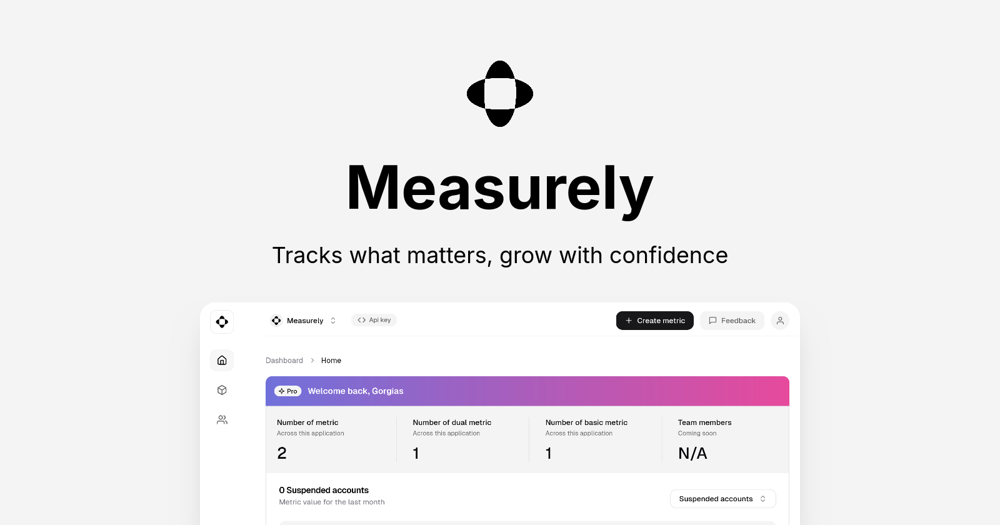

# Brand Assets

Welcome to Measurely's brand assets page. Here, you'll find all the resources you need to represent Measurely in your projects, presentations, or documentation. Please follow the guidelines below to ensure consistent and proper usage of our brand assets.

## Logo and Icon

Measurely's logo and icon are key elements of our brand identity. Below are the available assets and their recommended use cases.

|    Name     |                   Description                    |                         Preview                          |
| :---------: | :----------------------------------------------: | :------------------------------------------------------: |
|    Icon     | Useful for favicons, app icons, link icons, etc. |  |
|    Logo     |               Full Measurely logo                |  |
| Social Card |            The Measurely social card             |             |

## Usage Guidelines

### Do's:

- Use the provided logos and icons as-is.
- Ensure the logo is clearly visible and not distorted.
- Use the icon for smaller spaces like favicons or app icons.

### Don'ts:

- Do not modify the logo or icon in any way.
- Do not use the logo to represent your own project or product.
- Do not alter the colors or proportions of the logo.

## Design Assets

Feel free to use the Measurely logo and other assets in your project. However, please adhere to the usage guidelines above to maintain brand consistency.

## License

The Measurely brand assets are licensed under [the ELv2 license](https://github.com/measurely-dev/measurely/blob/main/LICENSE). By using these assets, you agree to comply with the terms of this license.

---

If you have any questions about using Measurely's brand assets, please contact us at [info@measurely.dev](mailto:info@measurely.dev).
